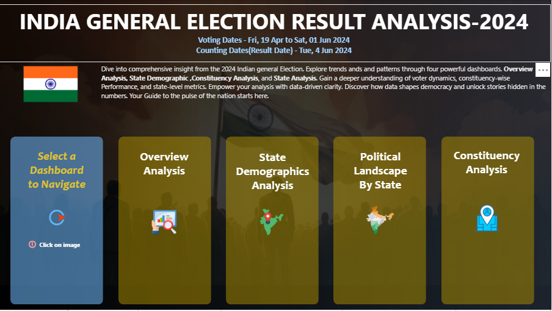
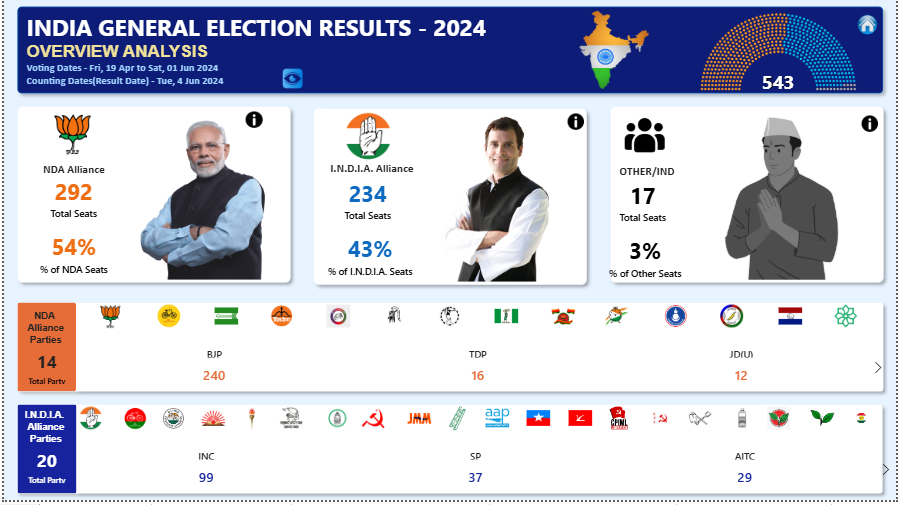
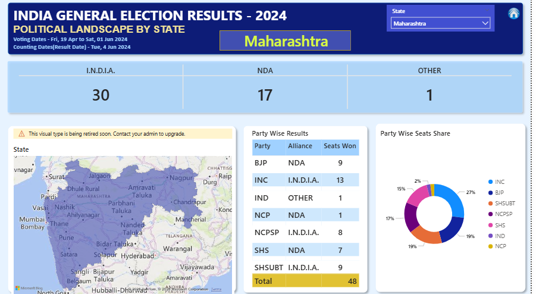
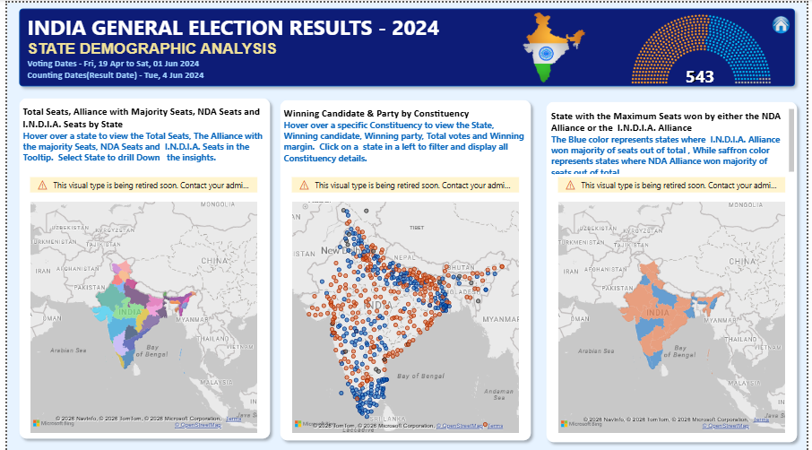
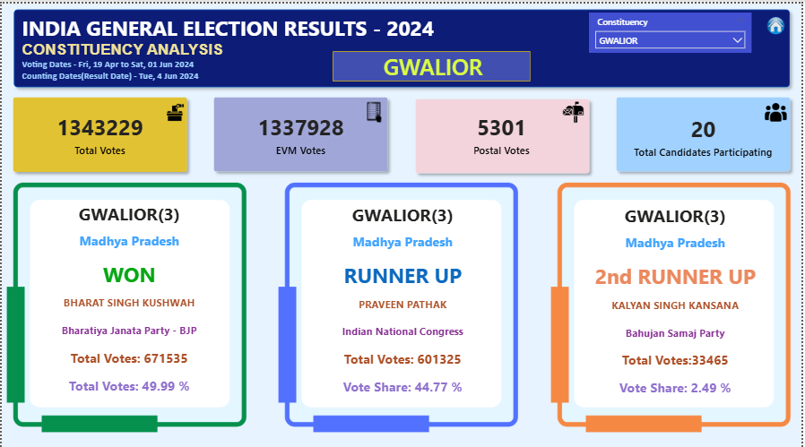
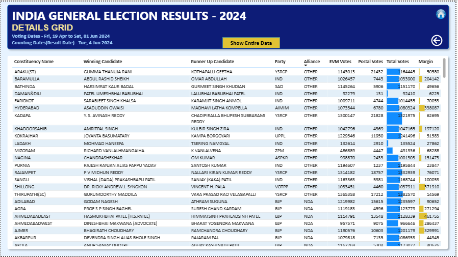

# 🗳️ India General Election Result Analysis – 2024 (Power BI)

An interactive Power BI report designed to explore the 2024 India General Election results through constituency-level analysis, state-level performance, alliance comparisons, and demographic insights.  
The dashboard enables intuitive navigation across multiple analytical views to uncover patterns in voting behavior and election outcomes.

---

## 📊 Report Pages

### 🚀 Landing Page  
Interactive navigation hub for accessing different analytical views.

---

### 📌 Overview Analysis  
High-level summary of seat distribution, alliance performance, and overall results.

---

### 🏛️ Political Landscape by State  
State-wise comparison of alliances and party performance.

---

### 🧮 State Demographic Analysis  
Visualization of seat dominance and winning patterns across states.

---

### 🗺️ Constituency Analysis  
Detailed constituency-level insights including vote share and candidate outcomes.

---

### 📋 Detailed Results Grid  
Tabular view enabling precise inspection of election outcomes, vote share, and comparisons.

---

## 🔎 Analytical Focus

- Alliance & party seat distribution  
- State-wise political dominance  
- Constituency-level performance  
- Voting patterns & margins  
- Comparative electoral analysis  

---

## 🛠 Tools & Skills Demonstrated

- SQL
- Power BI  
- DAX  
- Data Modeling  
- Interactive Navigation Design  
- Data Visualization  
- Analytical Storytelling  

---

## 🔗 Live Dashboard

👉 [View Report on Power BI Service](https://app.powerbi.com/view?r=eyJrIjoiOThmNjZkZDgtZTg2YS00Y2NiLTlmZDgtMzA3MzhjNmRhNWQ4IiwidCI6IjNiY2YzZjA3LWFkMDAtNDlkMC1iOTNiLWI3ZWQ0MDA1MzI3NyJ9)

---

